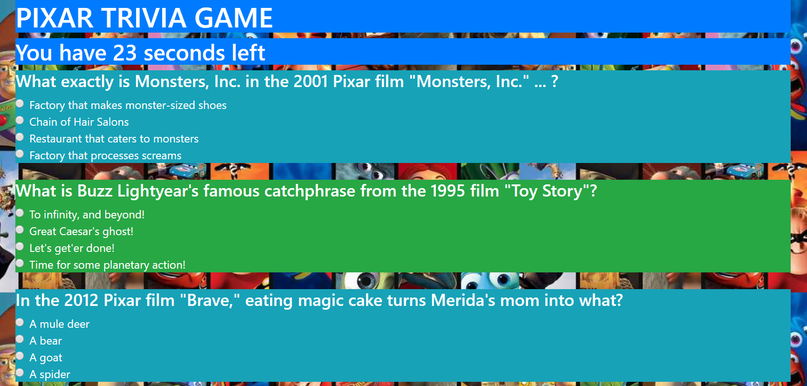
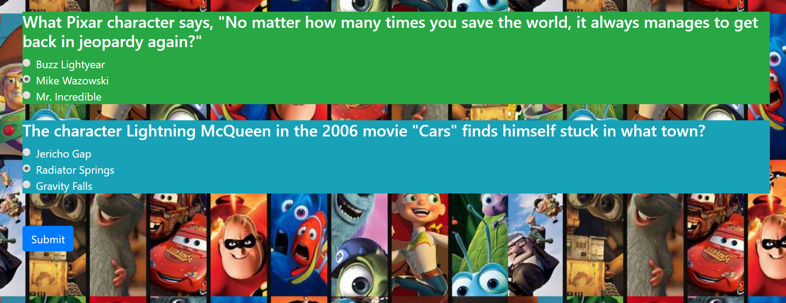
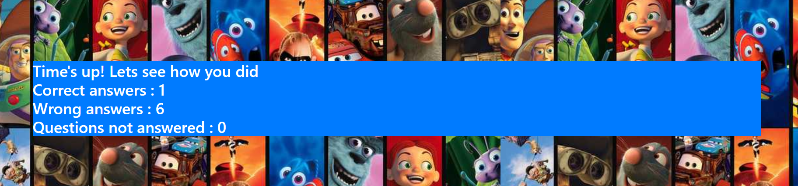

#  WELCOME TO TRIVAGAME

As the name suggests, this is a Triva Game based on the Pixar films

HTML, JAVASCRIPT and CSS were used to set this up

## Snapshot of the webpage:

## Guide to this project:

* Step 1: Click on the link - https://arif2301.github.io/TriviaGame/ to go to the webpage. Select the start button

* Step 2: You now have 30 seconds to answer all the trivia questions

* Step 3: Once completed, select submit. If you run out of time, the game will take you to the score page

* Step 4: The scorepage shows you how well you did on the trivia, click refresh on your browser to try this again.

Thank you for veiwing this project.
